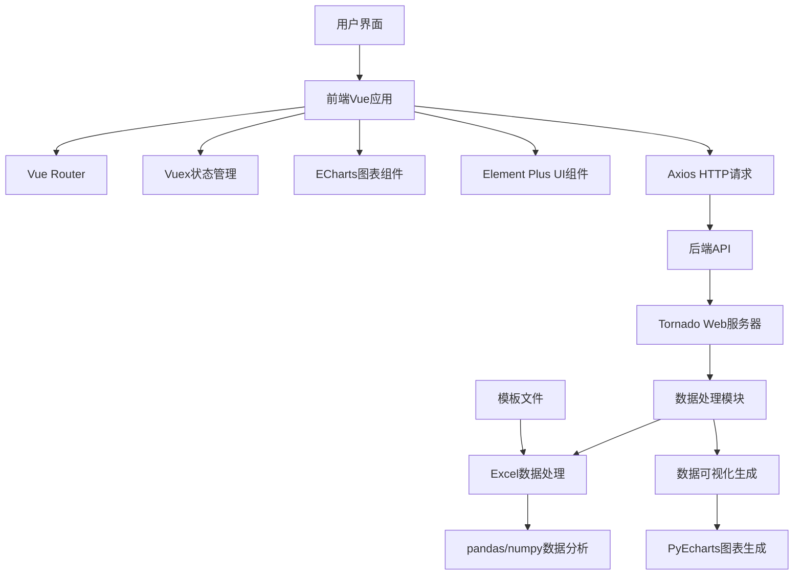

基于对项目代码的分析，将总结这个成绩可视化系统的架构、功能和不足之处。

## 前端启动方式

安装：
使用宽松安装，安装 webpack-cli 低版本
```
npm install --legacy-peer-deps --ignore-scripts
npm install -D webpack-cli@3
```

```
npm run dev
```

## 后端启动方式

```
python run.py
```

## 项目架构



## 项目技术栈

### 前端
- **框架**: Vue 3
- **路由**: Vue Router 4
- **状态管理**: Vuex 4
- **UI组件库**: Element Plus
- **HTTP客户端**: Axios
- **图表库**: ECharts
- **构建工具**: Vue CLI/Webpack

### 后端
- **Web框架**: Tornado
- **数据处理**: Pandas, NumPy
- **Excel处理**: OpenPyXL
- **图表生成**: PyEcharts
- **HTML解析**: BeautifulSoup

## 项目功能

这个系统是一个专注于成绩数据可视化的应用，主要功能包括：

1. **加权计算功能**: 对成绩进行加权计算
2. **合并表格功能**: 合并多个Excel表格
3. **折线图功能**: 生成成绩趋势折线图
4. **柱状图功能**: 生成成绩分布柱状图
5. **雨课堂功能**: 处理雨课堂导出的数据
6. **饼状图功能**: 生成成绩比例饼状图
7. **归一化成绩功能**: 对成绩进行归一化处理
8. **能力维度图功能**: 展示学生在不同能力维度的表现
9. **年得分率散点图功能**: 展示多年得分率的散点图
10. **SPOC雷达图**: 生成SPOC教学模式下的雷达图
11. **自定义SPOC雷达图**: 允许自定义雷达图参数
12. **基础归一化图**: 基础的归一化图表展示
13. **升级归一化图**: 增强版的归一化图表展示

## 数据流

1. 用户通过前端界面上传Excel格式的成绩数据
2. 前端将数据发送到后端API
3. 后端使用pandas和numpy进行数据处理和分析
4. 后端使用PyEcharts生成可视化图表
5. 生成的图表或处理后的数据返回给前端
6. 前端展示结果或提供下载

## 项目不足

1. **代码组织**: 后端代码组织不够清晰，功能模块混杂在一起，缺乏明确的分层
2. **错误处理**: 缺少完善的错误处理机制，可能导致系统在异常情况下崩溃
3. **安全性**: 未见明显的数据验证和安全措施，可能存在安全隐患
4. **可扩展性**: 功能模块耦合度高，难以扩展新功能
5. **前后端分离**: 虽然采用了前后端分离架构，但接口设计不够RESTful
6. **代码复用**: 存在代码重复现象，如多次导入相同的库
7. **依赖管理**: 存在多个requirements文件，依赖管理不够规范
8. **文档缺失**: 缺少详细的API文档和使用说明
9. **测试缺失**: 未见明显的测试代码，可能影响系统稳定性

这个项目是一个专注于教育领域的数据可视化系统，主要用于处理和展示学生成绩数据，通过各种图表形式帮助教师更好地理解学生的学习情况和成绩分布。系统采用前后端分离架构，前端使用Vue.js框架，后端使用Python的Tornado框架，结合pandas和PyEcharts实现数据处理和可视化功能。

> 
修改方式:每次修改前做一次 commit 提交作为开始,完成后再 commit 提交,作为结束.
 目的：希望以后变成一个非常方便扩展和维护，能够快速理解，二次开发的系统，目前在做功能的完善开发

> 修改记录：修改了前端文件的引入方式,参考 kimi回答
https://www.kimi.com/chat/d3adli9kotd1a03kkof0 
